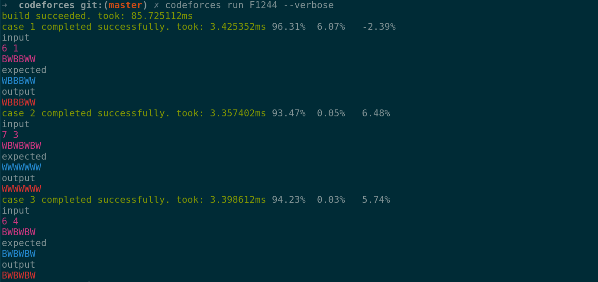
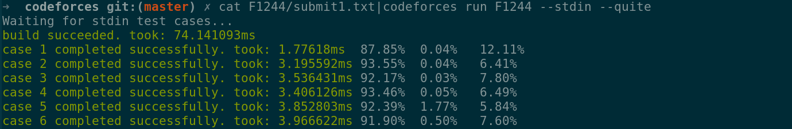

Code forces test runner

## Installation

### Requirements

golang

### Build

```sh
go get github.com/mie00/codeforces
```

## Screenshots

For usage see below




## Supported languages

```
go
c++
c
python
javascript
```

## Usage

```
codeforces test runner.

Usage:
  codeforces run <name> [--match-first-line] [--cmd=<cmd>] [--build-cmd=<cmd>] [--stdin] [--stdin-one] [--timeout=<timeout>] [--build-timeout=<timeout>] [--force-download] [--lang=<lang>] [--exit-on-failure] [--verbose] [--quite] [--strict-ellipsis] [--only=<n>] [--no-percentage]
  codeforces show <name> [--lang=<lang>] [--filename=<fname>] [--force-download]
  codeforces examples <name> [--force-download]
  codeforces list-langs
  codeforces -h | --help
  codeforces --version

Options:
  -h --help                                            Show this screen.
  --version                                            Show version.
  --match-first-line                                   Only match output first line [default: false].
  --lang=<lang>                                        Source code language use "codeforces list-langs" to list languages [default: go].
  --build-cmd=<cmd>                                    Command to execute the program, overrides lang [default: ].
  --cmd=<cmd>                                          Command to execute the program, overrides lang [default: ].
  --filename=<fname>                                   Default file name to show [default: ].
  --stdin                                              Get examples from stdin [default: false].
  --stdin-one                                          Get a single input from stdin. [default: false].
  --timeout=<timeout>                                  Timeout for a single case [default: 1s].
  --build-timeout=<timeout>                            Timeout for build [default: 10s].
  --force-download                                     Force download examples [default: false]
  --exit-on-failure                                    Exit on the first failed example [default: false].
  --verbose                                            Always show input/expected/output [default: false].
  --quite                                              Never show input/expected/output [default: false].
  --strict-ellipsis                                    Treat ellipsis (...) in output as is [default: false].
  --only=<n>                                           run only a specific test case, 0 means all [default: 0].
  --no-percentage                                      Show total time instead of percentage for steps instead of time [default: false].
```

## License

MIT
